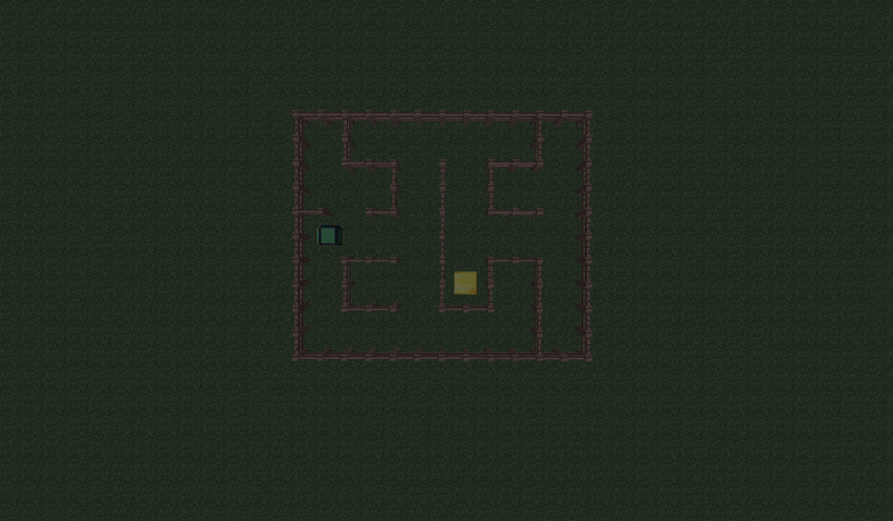
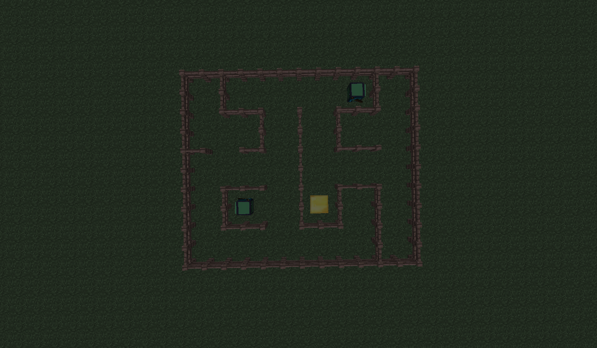

# Lesson Plan: 20.12.2025 - MinecraftEdu: From Visual to Lua

**Module:** MinecraftEdu (ComputerCraft)
**Topic:** Transition to Lua Scripting (Loops & Sensors)
**Teacher:** Sergio (Sub for Ivan)
**Duration:** 120 Minutes

## Objective
Shift from "Visual Remote" (stale/slow) to **Lua Scripting**.
**Core Goal:** Write a script that makes the turtle dig indefinitely or solve a navigation problem.

## Materials
- **Code:** `maze_solver.lua` (See Logic Section).
- **Images:** Reference screenshots for setup.


*(Fig 1: Initial Turtle Setup)*


*(Fig 2: Maze/Course Layout)*

---

## 1. Setup & The "Why" (00:00 - 00:20)
- **Problem:** Visual remote is slow. "What if I want the turtle to dig a 1000-block tunnel?"
- **Solution:** Code.
- **Activity:** Open the Turtle Interface -> Go to `Lua` command line.
    - Type `turtle.forward()` -> It moves.
    - Type `turtle.dig()` -> It digs.

## 2. Hello Loop (00:20 - 00:45)
- **Concept:** `while true do ... end`
- **Task:** The "Infinite Miner".
    ```lua
    while true do
        turtle.dig()
        turtle.forward()
    end
    ```
- **Challenge:** Run this script. Watch the turtle disappear into the mountain.

## 3. Sensors & Logic (00:45 - 00:60)
- **Problem:** "Stop mining when you hit Gold/Bedroll."
- **Command:** `turtle.inspectDown()`
- **Logic:**
    ```lua
    local success, block = turtle.inspectDown()
    if success and block.name == "minecraft:gold_block" then
        print("We found gold!")
        break
    end
    ```

## 4. BREAK (00:60 - 00:70)

## 5. The Maze Challenge (00:70 - 01:10)
**Differentiation Point:**
- **Standard Group:** Write a script to build a simple bridge (Place down, move forward).
- **Advanced Group (Flash/Alex types):** THE MAZE SOLVER.

### The Algorithm (Right-Hand Rule)
Use this logic for the advanced students. It requires understanding `turnRight`, `turnLeft`, and `forward` logic.

```lua
while true do
  -- Check for goal (Gold Block)
  local success, floor = turtle.inspectDown()
  if success and floor.name == "minecraft:gold_block" then
    print("Goal reached!") 
    break
  end

  -- Wall Follow Logic (Right-Hand Rule)
  turtle.turnRight() 
  -- Try to move Right (relative to old facing)
  -- If we can't move Right (Wall), turn Left (Face original)
  -- If we can't move Original (Wall), turn Left (Face Left)
  while not turtle.forward() do
    turtle.turnLeft()
  end
end
```
*Note: This specific code snippet assumes the turtle tries to hug the right wall.*

## 6. Optimization & Free Code (01:10 - 01:20)
- Allow students to modify the script.
- **Idea:** Add `turtle.attack()` to kill zombies in the maze?

## Management Tactics
- **The "Stale" Factor:** If they get bored with simple loops, IMMEDIATELY switch them to the Maze Challenge.
- **Discipline:** Use the "Freeze" button if they start grieving the map with infinite digging scripts.
